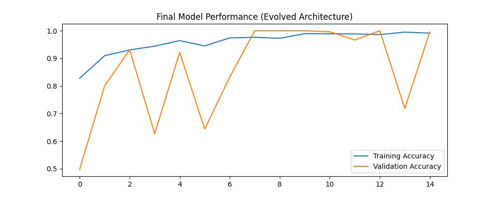

# Dino Hand Controller CV 🦖✋

A real-time **touchless hand gesture controller** for the Chrome Dino Game using Computer Vision. Control the dinosaur by simply moving your hand in front of the webcam — no keyboard required!

Built with **Python** and **OpenCV**, this project uses hand segmentation, contour analysis, and convexity defects to detect gestures and simulate keyboard inputs.


## ✨ Features

- Real-time hand gesture recognition using webcam
- Background subtraction and hand segmentation with **Otsu’s Binarization**
- Finger detection using **Convexity Defects**
- Automatic gesture classification
- Simulated keyboard control for Chrome Dino (Jump / Duck)
- Genetic Algorithm based parameter optimization
- Modular and easy-to-extend codebase

## 🛠️ Technologies Used

- Python
- OpenCV
- NumPy
- Genetic Algorithm (for optimization)
- Keyboard simulation (pyautogui / pynput)

## 📁 Project Structure

Dino-Hand-Controller-CV/
├── dataset/                  # Sample hand images (if any)
├── GA_optimization.py        # Genetic Algorithm for parameter tuning
├── Train.py                  # Training and processing script
├── imgcap.py                 # Webcam image capture utility
├── dino_con.py               # Main Dino game controller
├── final_training_graph.png  # Visualization of training results
├── README.md
└── requirements.txt

## 🚀 Installation

1. Clone the repository:
   ```bash
   git clone https://github.com/ChaXRium/Dino-Hand-Controller-CV.git
   cd Dino-Hand-Controller-CV
   ```

2. Create and activate a virtual environment (recommended):
   ```bash
   python -m venv venv
   # Windows
   venv\Scripts\activate
   # macOS / Linux
   source venv/bin/activate
   ```

3. Install dependencies:
   ```bash
   pip install opencv-python numpy pyautogui
   ```

## 🎮 How to Run

1. Open the Chrome Dino game:
   - Go to `chrome://dino` in Google Chrome
   - Or open a new tab and disconnect from the internet

2. Run the controller:
   ```bash
   python dino_con.py
   ```

3. Place your hand in front of the webcam in a well-lit environment with a relatively plain background.

4. Use hand gestures to control the dinosaur:
   - **Open hand / specific gesture** → Jump (Spacebar)
   - **Closed hand / other gesture** → Duck (Down Arrow)

> **Tip:** Better lighting and a simple background improve accuracy significantly.

## 🔍 How It Works

- Captures live video feed from the webcam
- Applies background subtraction and **Otsu’s thresholding** for hand segmentation
- Finds contours and calculates **convexity defects** to detect fingers
- Classifies gestures based on finger count and hand shape
- Sends corresponding keyboard commands to control the Dino game
- Includes Genetic Algorithm optimization for fine-tuning detection parameters

## 📊 Training & Optimization

You can optimize the gesture detection parameters using the Genetic Algorithm:

```bash
python GA_optimization.py
```

Training results and graphs are saved as `final_training_graph.png`.

## 📸 Screenshots




## 📄 License

This project is licensed under the **MIT License**. See the [LICENSE](LICENSE) file for more details.

---

**Made with ❤️ and Computer Vision in Sri Lanka**

If you found this project useful, please give it a ⭐ on GitHub!

